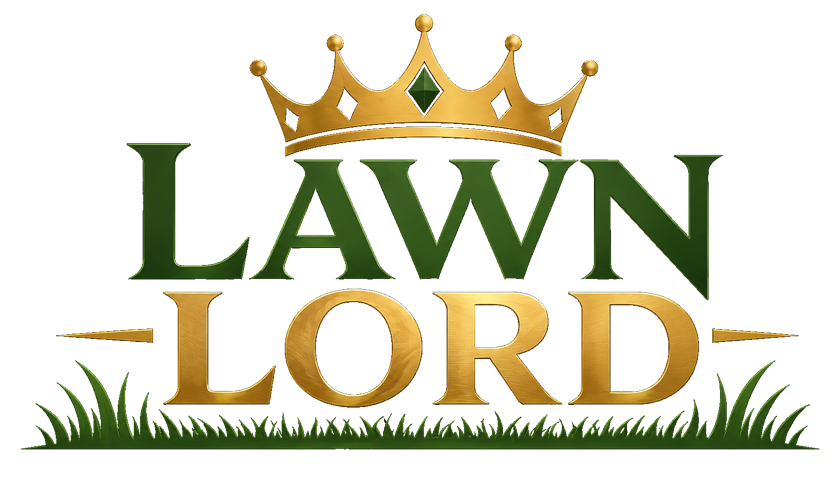

<p align="center"></p>

# lawnlord

*Ingest a case's filings and sort them into the schema you need to analyze the case — and fight it. Verifiable, and traceable to the source.*


A local-first **legal case-understanding engine**. It **ingests a case's filings** (from one or both
court portals) and **sorts them into the schema you need to analyze the case and fight it** — case →
parties/events → filed images → the documents and exhibits within them — a verifiable, searchable
substrate where every conclusion traces back to a real source page.

It is **not** a PDF splitter. lawnlord mirrors the court's filed record *exactly*, extracts every
page to searchable text, and **proves** the result is lossless against the originals — so every
downstream conclusion traces back to a real source page.

📖 **Why this exists →** [`docs/motivation.md`](docs/motivation.md)

> **Status:** installable CLI, shipped through **v0.3.0**. Where we've been —
> [CHANGELOG.md](CHANGELOG.md); where we're going — [ROADMAP.md](ROADMAP.md).

## What it produces

`lawnlord bundle` wraps a complete case into one self-contained, cross-linked zip:

```text
case.json              standard metadata wrapper — read this, reach everything
filings/               preserved original PDFs, hash-pinned (the source of truth)
case-master.pdf        the whole case reassembled in docket order — text- & visual-lossless
pages/                 per-page extracted text (searchable, OCR'd when scanned)
lawnlord.duckdb        the queryable index (case → event → image → document → page)
bundle-manifest.json   cross-links: image ↔ its pages ↔ master-PDF pages ↔ filing
```

Proven on a real case: **22 filed images → one 255-page master PDF**, every page traceable to its
source image and page, text- and visual-lossless.

## Install

```bash
uv add lawnlord                      # as a project dependency
# or, for local development from a sibling checkout:
#   [tool.uv.sources] lawnlord = { path = "../lawnlord", editable = true }
```

## Usage

lawnlord operates on an **intake folder** — a provider folder (e.g. `intake/combo`) holding the
case JSON plus its `filings/`, with generated output written alongside.

```bash
lawnlord start [root]                # scaffold intake/ + lawnlord.toml + an intake README
lawnlord report [root]               # read-only archive/section report; never writes
lawnlord build [root]                # explode the corpus from the intake packet
lawnlord build [root] --force        # rebuild (preserves reviewed analysis)
lawnlord emit-boundaries [root]      # write a reviewable manual-boundary draft
lawnlord index [intake]              # explode a provider intake's filings + index into DuckDB
lawnlord pack [intake]               # package the source of truth: case.json + all filings in one zip
lawnlord assemble [intake]           # reassemble images into one master PDF (lossless round-trip proof)
lawnlord bundle [intake]             # the capstone: case wrapped with metadata + master + pages + index
lawnlord query [--case-dir DIR] --text "…"   # read-only full-text search over the index (with provenance)
```

`build`/`report`/`emit-boundaries` take `--packet` to point at a specific ZIP. `index`/`pack`/
`assemble`/`bundle` take a provider **intake folder** (`[intake]`); `query` reads the built
`lawnlord.duckdb` under `--case-dir`. `python -m lawnlord …` works as an alternative to the console
script.

### Intake layout

```text
<root>/
  lawnlord.toml      # optional config: intake/corpus dir names
  intake/            # inputs: the packet ZIP + optional curated files
    <packet>.zip
    bundle-boundaries.json   (optional — manual section boundaries, Tier 1)
    corpus-curation.json     (optional — curated metadata overlay)
  corpus/            # generated output (regenerable)
```

## What's guaranteed

- **Mirror exactly, then add.** lawnlord reproduces the court's filed structure as the **immutable
  record**; all analysis is *additive* and can never alter generated provenance — hashes, page
  ranges, slugs, boundary tier/confidence, paths, or citations.
- **Human-owned legal conclusions.** Page-analysis fields are never pre-filled. The tool surfaces
  and *proposes*; the human decides.
- **Deterministic & regenerable.** Boundary detection is a four-tier, confidence-scored process
  (manual → bookmarks → heading scan → fallback); the index and bundle are pure functions of the
  intake — nothing is authored in place.

## Development

```bash
uv run pytest                        # characterization + end-to-end suite (174 tests)
```

The tests are **characterization tests**: they pin current behavior, so a failing test is a
behavior change to approve by hand, not to silently update.

## Documentation

This README is the project's homepage and present state. The documents below are the project's
standards and code summaries — each is kept current or deleted when no longer relevant.

**How we work**
- [`docs/contributing.md`](docs/contributing.md) — the doc model, conventions, and non-negotiable engineering invariants.

**Code summaries** (provable by reading the source)
- [`docs/architecture.md`](docs/architecture.md) — modules, data flow, the DuckDB schema, enforced invariants.
- [`docs/schema.md`](docs/schema.md) — the canonical `case.json` + DuckDB schema as implemented.
- [`docs/ux.md`](docs/ux.md) — the CLI and user-facing behavior.

**Why & how you use it**
- [`docs/motivation.md`](docs/motivation.md) — the problem, the solution, and how you use it and benefit.

**Brand**
- [`docs/brand/brand-guide.md`](docs/brand/brand-guide.md) — the brand kit: palette, shadcn/ui tokens, Tailwind preset, Google Fonts, swatch sheet, and a PDF guide.

**Plan & history**
- [`ROADMAP.md`](ROADMAP.md) — where we're going. The plan is the [GitHub issues](https://github.com/jwogrady/lawnlord/issues) assigned to each milestone; the roadmap narrates them.
- [`CHANGELOG.md`](CHANGELOG.md) — where we've been.

## License

Proprietary — © 2026 jwogrady. **All rights reserved.** This repository is published for reference
and transparency only; no permission is granted to use, copy, modify, or distribute the software or
its source. See [`LICENSE`](LICENSE). (The most restrictive license stands until the project is
opened to contributors or release.)
