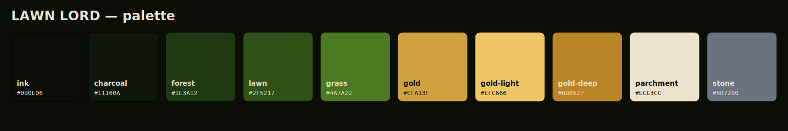

# LAWN LORD — brand kit

Everything a **Tailwind** + **shadcn/ui** project needs. Generated from one source of truth —
`scripts/build_brand_kit.py` (`uv run python scripts/build_brand_kit.py` to regenerate).



**[📄 brand-guide.pdf](brand-guide.pdf)** — the printable guide.

## Logo

- **Wordmark** — [`../assets/lawnlord.png`](../assets/lawnlord.png): the primary logo (headers, banners).
- **Crest** — [`../assets/crest.png`](../assets/crest.png): the emblem / favicon / app icon
  ("Defend your castle. Protect your kingdom.").

## Color

| token | hex | role |
|---|---|---|
| `brand-ink` | `#0B0E06` | near-black base — page background |
| `brand-charcoal` | `#11160A` | cards / panels |
| `brand-forest` | `#1E3A12` | dark green — secondary |
| `brand-lawn` | `#2F5217` | the LAWN green |
| `brand-grass` | `#4A7A22` | bright grass — accent |
| `brand-gold` | `#CFA13F` | the LORD gold — primary |
| `brand-gold-light` | `#EFC666` | gold highlight |
| `brand-gold-deep` | `#BB8527` | gold shadow |
| `brand-parchment` | `#ECE3CC` | cream — foreground on dark |
| `brand-stone` | `#6B7280` | castle stone — neutral |

## Type

- **Display — Cinzel** (regal serif): headings, the wordmark.
- **Body — Inter**: UI and body text.

Both from Google Fonts — import [`fonts.css`](fonts.css).

## Use it

**shadcn/ui** — copy [`tokens.css`](tokens.css) into your `globals.css`. It defines the semantic
variables (`--background`, `--foreground`, `--primary`, `--secondary`, `--muted`, `--accent`,
`--border`, `--ring`, `--radius`, …) as HSL triplets, light by default with a `.dark` theme — exactly
what shadcn components consume.

**Tailwind** — add the preset:

```js
// tailwind.config.js
module.exports = { presets: [require("./docs/brand/tailwind.preset.js")] };
```

Then use semantic + brand classes: `bg-background text-foreground`, `bg-primary
text-primary-foreground`, `bg-brand-gold text-brand-ink`, `font-display`, `rounded-lg`.

## Files

| file | what |
|---|---|
| `tokens.css` | shadcn semantic tokens (light `:root` + `.dark`) + the raw brand scale |
| `tailwind.preset.js` | Tailwind preset — semantic colors via `hsl(var())`, the `brand-*` scale, fonts, radius |
| `fonts.css` | Google Fonts import (Cinzel + Inter) + `--font-display` / `--font-sans` |
| `palette.svg` | the swatch sheet above |
| `brand-guide.pdf` | the printable guide |
