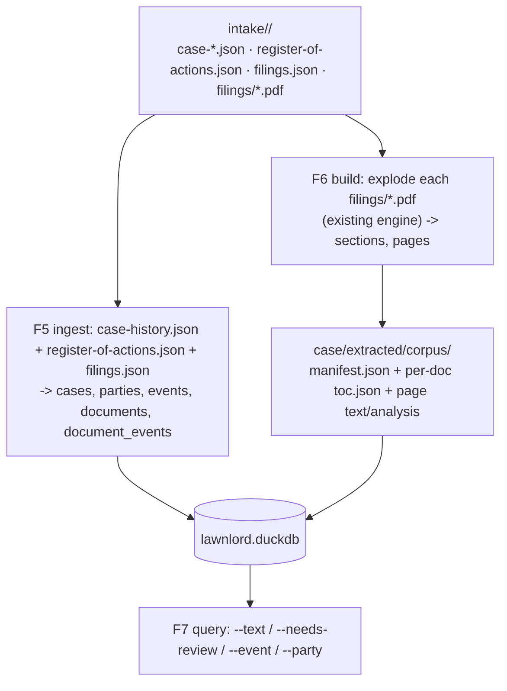

# Milestone 1 — Case Workspace + Case/Event/Document Index

> **Revision note.** Rewritten after analyzing the real intake materials in `intake/ody/`
> (case `25-09-14566`). `ody` = **Odyssey** — the Montgomery County court-records portal
> (`odyssey.mctx.org`); the folder is named for the **source provider**, not the case. The input is
> **not** a single ZIP — it is a provider export folder containing authoritative case/event/document
> metadata (4 JSON files) plus a `filings/` folder of source PDFs. The model is now **case → event →
> document → section → page**, and the Odyssey JSON is the curated source of truth that feeds
> identity, dates, document types, parties, and the docket. This supersedes the prior ZIP-driven
> `archive → submission → document → section → page` framing.
>
> **Location:** the case data lives in the separate **`gcp-hoa-case`** repo (the case archive), not
> in this tool repo. lawnlord runs against its intake folder, e.g. `../gcp-hoa-case/intake/ody`.

## Context

`docs/` describes lawnlord as a local-first **legal understanding engine** over a portable case
workspace. The **shipped code is one deterministic slice**: a PDF exploder that decomposes a PDF
into Section → Page artifacts with provenance, four-tier boundary detection, a curation overlay,
and `--force` review preservation. `src/lawnlord/paths.py` carries a `NOTE (decoupling pending)`:
input/output is hardcoded to `REPO_ROOT` and assumes a single ZIP at `src/filings/E222C7C4.zip`
(which no longer exists — it was an earlier export of this very case).

The real source of truth is the **intake provider folder** (`intake/<provider>/`, e.g.
`intake/ody/` for an Odyssey export), structured as **case → events → documents**, with each
document still requiring Section → Page decomposition. M1 turns lawnlord into a tool that ingests
such a folder: it reads the authoritative metadata, explodes each document, and builds a DuckDB
index of the whole `case → event → document → section → page` model — **without rewriting the
working extraction engine** and **without guessing anything the intake metadata already states**.

### Intake source structure (the source of truth)

Organized by **source provider**. `ody` = Odyssey (`odyssey.mctx.org`) — the first provider; the
four-JSON shape below is the Odyssey export schema, so the reader is a provider adapter (others can
follow). Currently one Odyssey export holds one case directly under `intake/ody/`.

```
intake/ody/                            # Odyssey (odyssey.mctx.org) export — case 25-09-14566
├── case-summary.json                  # caseNumber, caseTitle, court, caseType, status, sourceUrl, dateFiled
├── case-history.json                  # parties[]+attorneys, disposition, timeline[] (events: date/phase/event/files),
│                                       #   financialInformation, sources[]   ← richest event source
├── register-of-actions.json           # docket: parties, dispositions[], otherEventsAndHearings[] (date/desc/party/files),
│                                       #   financialInformation.transactions[]
├── filings.json                       # document index: {date, event, image(=title), pageCount, file} across
│                                       #   selectedEvent / otherEventsOnThisCase / otherImagesOnThisCase
├── CASE_HISTORY.md                     # human narrative (derived; not parsed)
└── filings/                            # 22 source PDFs (the documents), e.g. Plaintiffs_Motion_for_Summary_Judgment.pdf
```

Observed facts (case `25-09-14566`, *Grand Central Park Residential Association v. O'Grady*,
284th District Court, Montgomery County TX, Judge Bays, Foreclosure, Disposed by Final Summary
Judgment): 3 parties (1 plaintiff + 2 retained attorneys; 2 pro-se defendants), 4 phases
(Pleadings & Service → Scheduling & Discovery → Summary Judgment → Judgment & Disposition),
22 documents, ~255 declared pages.

### Key structural facts that shape the design

- **Events ↔ documents is many-to-many.** A docket event lists multiple `files[]`; the same PDF
  (e.g. `Final_Summary_Judgment.pdf`) appears under several events. → a `document_events` join, and
  documents are **deduplicated by file (sha256)**, not per docket row.
- **The JSON is authoritative, the PDFs are immutable.** Document title (`filings.json.image`),
  filing date, docket event type, parties, disposition, and financials come from the intake JSON —
  never guessed. Heuristic `documentFamily` detection drops to a *secondary* signal.
- **Declared vs actual pages.** `filings.json` declares `pageCount` per document; the exploder reads
  the real count. The indexer cross-checks them and flags mismatches (integrity, not silent trust).
- **Input is loose PDFs in a folder**, not a ZIP — the exploder's source front-end must read
  `filings/*.pdf` directly (ZIP support stays for that input mode).

**Deliverable:** implement the features + tests in this session and open a single PR off a feature
branch. No GitHub issues are created. Deferred to later milestones: extracting entities *from inside*
the PDFs (deadlines from the Docket Control Order, claims, citations), OCR, and classification of
un-docketed files.

## Guiding principles

- **DuckDB indexes the filesystem; it never authors content.** Regenerable from the intake JSON +
  the exploded corpus.
- **Curated intake metadata wins over detection.** Identity/dates/types/parties come from the JSON;
  detection (`documentFamily`, boundary confidence) is recorded but never overrides curated truth.
- **Reuse existing identity, never mint new schemes** for the exploder layer (`doc_/sec_` IDs,
  slugs, `sha256`, `sourcePageNumber`, `citation.{lowLevel,display}`). Case/event identity derives
  from the intake JSON (caseNumber, docket date+event).
- **The index is a pure function of (intake JSON + corpus).** Row timestamps come from the corpus
  `generatedAt`, never index-time wall-clock, so re-indexing is byte-identical.
- **`__init__.py` is a frozen re-export contract** (~74 symbols). Add names (`Case`, `open_case_db`,
  `apply_schema`, intake/ingest helpers); never remove or rename existing exports.

## Model & data flow



**Five-level spine:** `case` (intake identity) → `event` (docket) → `document` (the PDF) →
`section` → `page` (exploder decomposition). Events and documents join many-to-many.

**Sequencing:** F1 unblocks all → F3 (parser) → F2 ∥ F4 → F5 (metadata ingest) ∥ F6 (explode+index
corpus) both need F4 → F7 needs F5+F6.

---

## Feature 1 — Case workspace + intake-folder resolution (realize the decoupling)

**Outcome:** lawnlord operates on an **intake case folder** and a `--case-dir` output root (default
cwd), with no `REPO_ROOT` dependency. Resolves a `Case` from `intake/<case>/`: reads the four JSON
metadata files and the `filings/*.pdf` set.

**Create `src/lawnlord/workspace.py`** — a `Case` resolver exposing: the intake paths
(`case_summary`, `case_history`, `register_of_actions`, `filings_json`, `filings_dir`), the output
subtree (`intake/ artifacts/ knowledgebase/ extracted/ analysis/ outputs/ manifests/`),
`corpus_dir` = `<root>/extracted/corpus/`, `duckdb_path`, and `case_json_path`. The **case slug**
derives from `caseNumber` (e.g. `25-09-14566`), not the folder name (`ody`).

**Create `src/lawnlord/intake.py`** — a **provider-adapter** layer that parses a provider export
into typed dataclasses (`CaseIdentity`, `Party`, `Event`, `DocumentRef`). The first adapter,
`odyssey` (`ody`), reads the four JSON files; the adapter is selected by the provider folder name so
future providers plug in without touching the model. No I/O beyond reading; tolerant of the field
variations across Odyssey's three event sources (timeline / otherEventsAndHearings / filings.json),
de-duplicating events by (date, event, files) and documents by file path.

**Modify:** `paths.py` → keep `REPO_ROOT`/`FILINGS_DIR`/zip constants only as a **legacy ZIP-input
shim**, confined to this file; route output through `Case`. `boundaries.load_manual_boundaries()` /
`curation.load_curation()` → optional path arg (default preserves behavior). `__init__.py` →
re-export `Case` and the intake dataclasses.

**Acceptance:** `Case.from_intake("../gcp-hoa-case/intake/ody")` yields caseNumber `25-09-14566`, 3 parties, the
phase-ordered events, and 22 document refs; `grep -rn "REPO_ROOT" src/lawnlord/` is confined to
`paths.py`; all four existing test files pass unchanged.

## Feature 2 — `lawnlord start` scaffold + intake contract

**Outcome:** `lawnlord start [dir]` materializes the `case/` skeleton (7 dirs + `manifests/case.json`
+ an `lawnlord.duckdb` with schema applied) and documents the intake-folder contract (which JSON
files + `filings/` it expects). `case.json` carries the human identity fields, pre-filled from the
intake `case-summary.json` when present, else empty (never guessed).

**Modify:** `cli.py` (`start`), `workspace.py` (`scaffold()`). **Reuse:** idempotent `mkdir` style
from `corpus.py`; `analysis_schema.write_json`.

**Acceptance:** `lawnlord start /tmp/c` builds the tree; re-running is a non-destructive no-op.

## Feature 3 — Promote CLI to subcommands (preserve current behavior)

**Outcome:** `lawnlord start | build | index | query`; existing exploder flags preserved under
`build` (alias `explode`). `build` now accepts an intake case folder (explodes `filings/*.pdf`) as
well as the legacy single-ZIP path; `--case-dir` sets the output root.

**Modify `cli.py`:** flat parser → subparsers; move emit-template/dry-run/write bodies into `build`;
keep `--corpus-dir`/`--force`/`--dry-run`/`--emit-boundary-template`; add `--case-dir`.

**Acceptance:** every existing flag works under `lawnlord build ...`; `--help` lists subcommands;
`inspect_archive`/`write_corpus` change only to accept injected case/curation paths + a folder source.

## Feature 4 — DuckDB layer + M1 schema (case/event/document/section/page)

**Outcome:** `src/lawnlord/db.py` opens `case/lawnlord.duckdb` and applies an idempotent, versioned
schema (the only SQL site). Adds `duckdb>=1.1` (via `uv add`; confirm a cp313 wheel for
`requires-python >=3.13`). Re-export `open_case_db`, `apply_schema`.

**Acceptance:** `apply_schema` run twice is a no-op; the tables below exist.

## Feature 5 — Intake metadata ingestion (case, parties, events, documents, links)

**Outcome:** parse the intake JSON (via `intake.py`) into DuckDB: one `cases` row, the `parties`,
the docket `events`, the `documents` (deduped by file/sha256), and the `document_events`
many-to-many join. Curated fields (title, filing date, docket event type, party, phase) come
straight from the JSON.

**`artifact_type` / `event_type`** come from the docket (`filings.json.event` /
`register-of-actions` description / `case-history` event) — authoritative, **not** heuristic
`documentFamily`. Document title = `filings.json.image`.

**Acceptance:** after ingest of `intake/ody`: `cases`=1, `parties`=3, `events` == the de-duplicated
docket count, `documents`=22, and `document_events` reflects the many-to-many (e.g.
`Final_Summary_Judgment.pdf` linked to multiple events). No PDF is parsed in this step.

## Feature 6 — Explode + index the corpus (sections, pages; cross-check)

**Outcome:** explode each `filings/*.pdf` with the existing engine into `case/extracted/corpus/`,
then index `sections` and `chunks` (one row per page) driven by `manifest.json` + per-document
`toc.json` (authoritative page enumeration — no globbing). Each document's exploded output links to
its `documents` row (by sha256/slug).

**Cross-check:** the exploder's actual page count per document is compared to
`filings.json.pageCount`; a mismatch sets a `page_count_mismatch` flag on the document and is
reported (integrity — declared metadata is verified, not trusted blindly).

**Deterministic timestamps** from corpus `generatedAt`. **Integrity guard:** chunk count == summed
section page counts; every `sourcePageNumber` appears exactly once per document; fail loudly on
mismatch or missing `manifest.json`.

**Acceptance:** `SELECT count(*) FROM chunks` == total exploded pages; `sections` count == total
sections; every chunk row has non-null `document_id`, `source_page_number`, `citation_display`;
re-indexing yields a byte-identical DB dump; page-count mismatches (if any) are flagged, not hidden.

## Feature 7 — `lawnlord query`

**Outcome:** read-only search with provenance, rendered via the existing `rich` console style.
Supports `--text` (full-text over `chunks`), `--needs-review` (sections whose persisted
`needsHumanReview` is true — folds in OCR, not just confidence), and the new docket dimensions
`--event <type>` / `--phase <phase>` / `--party <name>` (join `events`/`document_events`).

**Acceptance:** `--text "summary judgment"` returns rows with document title + source page +
citation; `--needs-review` matches persisted review flags; `--phase "Summary Judgment"` returns the
documents filed in that phase.

---

## DuckDB schema — M1

Mirrors `case → event → document → section → page` plus parties and the event↔document join. Defer
`entities/relationships/citations/deadlines/analysis_results` to later milestones.

- **`cases`**: `id` (=`caseNumber`, e.g. `25-09-14566`), `title`, `court`, `judicial_officer`,
  `case_type`, `status`, `date_filed`, `disposition_type`, `disposition_date`, `source_url`,
  `total_assessment`, `balance_due`, `created_at`, `updated_at`. (from `case-summary.json` +
  `case-history.json`.)
- **`parties`**: `id`, `case_id`, `role` (Plaintiff/Defendant), `name`, `representation`
  (`Pro Se`/attorney names), `attorneys` (JSON list), `location`.
- **`events`** (docket): `id` (=`{case}_{date}_{slug(event)}`), `case_id`, `date`, `phase`
  (Pleadings & Service / Scheduling & Discovery / Summary Judgment / Judgment & Disposition),
  `event_type`, `description`, `party`, `judicial_officer`, `created_at`.
- **`documents`** (the PDF; = exploder "document"): `id` (=`doc_<sha16>`), `case_id`, `filename`,
  `title` (=`filings.json.image`), `file_path` (corpus-relative `source.pdf`), `intake_path`
  (`filings/<name>.pdf`), `docket_type` (=docket `event`/description), `filing_date`,
  `declared_page_count` (=`filings.json.pageCount`), `actual_page_count` (from exploder),
  `page_count_mismatch` (bool), `sha256_hash` NOT NULL, `needs_review`, `created_at`.
- **`document_events`** (many-to-many): `document_id`, `event_id`, PK(`document_id`,`event_id`).
- **`sections`**: `id` (=`sectionId`), `case_id`, `document_id`, `section_slug`, `section_index`,
  `title`, `source_page_start`, `source_page_end`, `page_count`, `boundary_confidence`,
  `detection_tier`, `document_family` (secondary detection signal — *not* a classification),
  `needs_review` (=`needsHumanReview`), `created_at`.
- **`chunks`** (= page): `id` (=`{sectionId}_p{sourcePageNumber}`), `case_id`, `document_id`,
  `section_id`, `text` (verbatim), `page_number`, `source_page_number`,
  `paragraph_number`/`text_span_start`/`text_span_end` (NULL in M1), `extraction_method`
  (`'pdf_text'`), `citation_low`, `citation_display`, `confidence`, `created_at`.
- **`knowledge_documents`**: structure only (populated by a later milestone).

## Later milestones (sequence only)

- **M2** — extraction depth: OCR for `ocrLikelyNeeded` pages; paragraph chunking fills the nullable
  `chunks` span columns; intake of un-docketed/knowledge files into `knowledgebase/*`; relocate
  immutable source PDFs into `artifacts/`.
- **M3** — entity layer: decompose chunks into Facts/Events/Claims/Citations/**Deadlines** (e.g.
  parse the Docket Control Order PDF) into an `entities` table keyed to `source_chunk_id` +
  `document_id`. AI writes here with `needsReview: true` — never into the human-owned page legal
  fields or the curated intake metadata.
- **M4** — `relationships` / case graph (Claim→governed-by→Statute, Order→creates→Deadline,
  Document→responds-to→Document, e.g. Response ↔ MSJ).
- **M5** — reasoning: timelines (seeded by the docket `events`), evidence maps, gap/contradiction
  analysis into `analysis_results`.
- **M6** — drafting into `outputs/`, grounded in facts/evidence/law/procedure; Review pass.
- **M7** — agents + a read-only dashboard over DuckDB answering the four UX questions.

## Invariants that must not break

- **Curated intake metadata is authoritative** — identity/dates/types/parties/disposition from the
  JSON are never overwritten by detection; `documentFamily`/confidence are recorded as secondary.
- **Determinism / regenerability** — DuckDB rebuildable from intake JSON + corpus; `index`
  drops+rebuilds; timestamps from `generatedAt` → byte-identical re-index.
- **Gapless page coverage** — `boundaries.covers_exactly` (pinned by `test_sections`); the integrity
  guard asserts every `sourcePageNumber` once and chunk count == summed section pages; declared vs
  actual page counts cross-checked and flagged.
- **Provenance everywhere** — reuse `doc_/sec_` IDs, slugs, sha256, `sourcePageNumber`, `citation`;
  case/event IDs derive from caseNumber + docket date/event.
- **Never auto-fill legal fields** — `analysis_schema.legal_analysis_placeholders()` stays empty; AI
  output lives in the future `entities` table.
- **`--force` review preservation** — `preservation.*` (pinned by `test_preservation`) keeps working;
  re-root its corpus glob to the case corpus dir in lockstep with F1.
- **Curation whitelist** — `curation.ALLOWED_CURATED_FIELDS` + `apply_metadata_overlay` (pinned by
  `test_helpers`) unchanged.
- **Frozen `__init__.py` surface** — only add exports.

## Verification (end-to-end for M1, using `intake/ody`)

1. **Existing suite stays green:** `uv run pytest` → `test_helpers`/`test_sections`/
   `test_preservation` unchanged; `test_baseline` skips without the legacy ZIP.
2. **New M1 tests (hermetic, `tmp_path`):**
   - `test_intake.py`: parse synthetic copies of the four JSON shapes → correct case/parties/events/
     documents; events de-duplicated; documents deduped by file; many-to-many links correct.
   - `test_workspace.py`: `Case.from_intake` resolves intake + output paths; `start` scaffolds;
     idempotent.
   - `test_db.py`: `apply_schema` idempotent; all M1 tables/columns present.
   - `test_index.py`: build a synthetic corpus + intake → ingest + index; assert `documents`=N,
     `events` count, `chunks` == pages, page-count cross-check flags a deliberate mismatch, re-index
     byte-identical, integrity guard raises on a dropped page.
3. **Real-data smoke (`../gcp-hoa-case/intake/ody`):**
   `uv run lawnlord build ../gcp-hoa-case/intake/ody --case-dir /tmp/ody` → explodes 22 PDFs
   (~255 pages) → `uv run lawnlord index --case-dir /tmp/ody` → `cases`=1, `parties`=3,
   `documents`=22, events populated, `chunks` == exploded page total →
   `uv run lawnlord query --case-dir /tmp/ody --phase "Summary Judgment"` and `--text "summary judgment"`.
4. **Determinism:** index the same case twice → byte-identical table dumps.

## Open decisions (flag for confirmation)

1. **Scope:** M1 now spans intake-folder input + a case/event/document/parties layer + the exploder
   index — larger than the original ZIP-only M1. Acceptable as one PR, or split metadata ingestion
   (F5) into its own milestone?
2. **Provider vs case naming:** intake folders are named for the **source provider** (`ody` =
   Odyssey), not the case; the case *identity* (and DB `cases.id`) comes from
   `case-summary.json` (`caseNumber`, e.g. `25-09-14566`). Confirm: provider folder = adapter
   selector, case slug = `caseNumber`. Open question for later: if one provider holds multiple
   cases, is the layout `intake/<provider>/<case>/`?
3. **Knowledge base:** every document here is a case artifact (docketed). No knowledge-base
   materials present yet, so `knowledge_documents` stays structure-only in M1.
